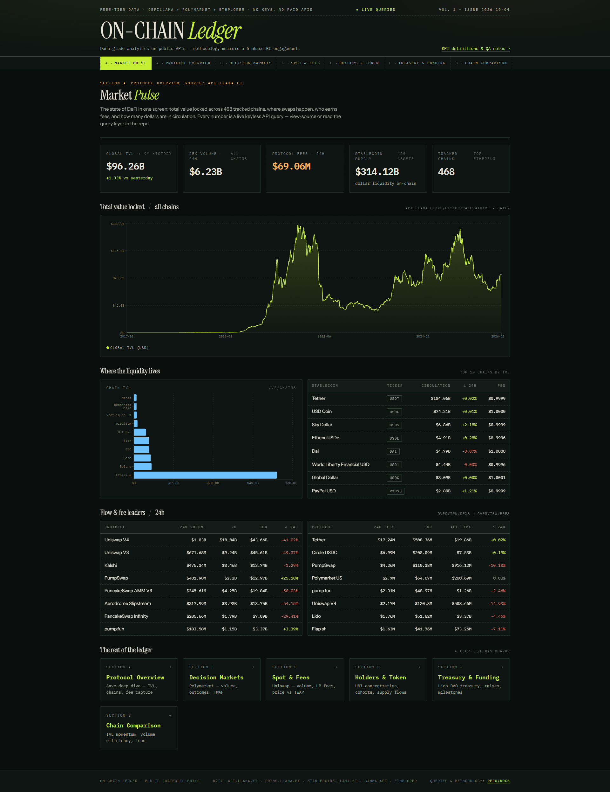
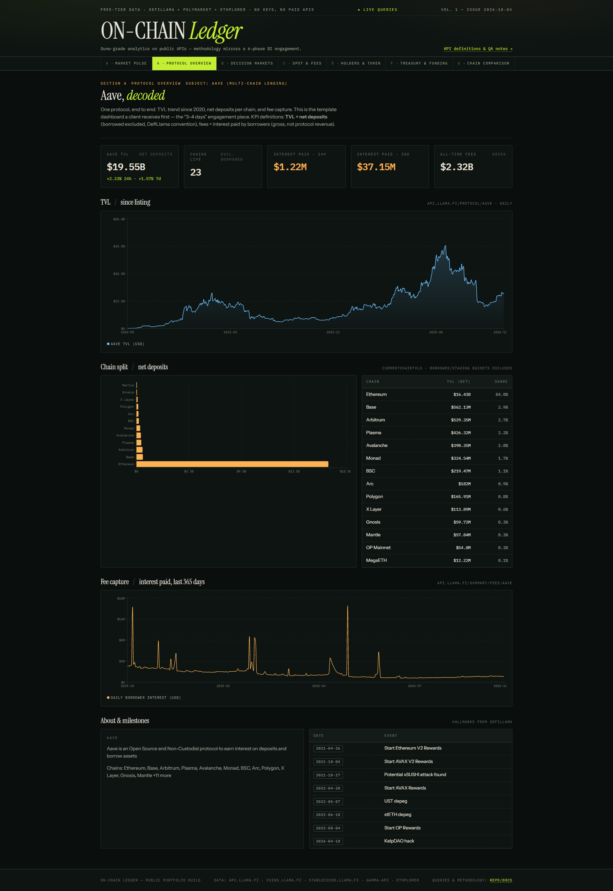
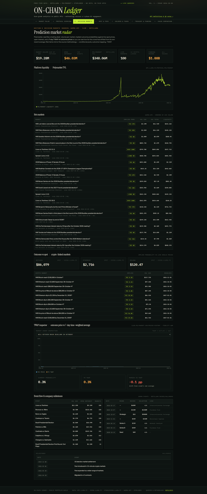
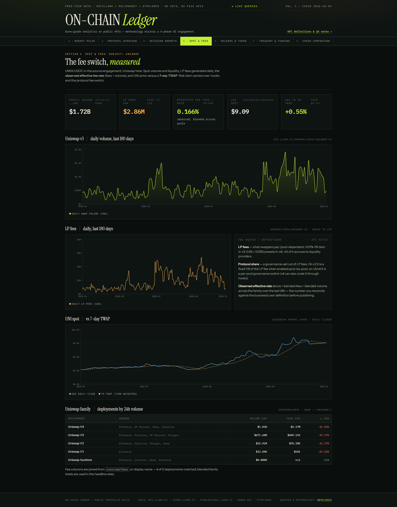
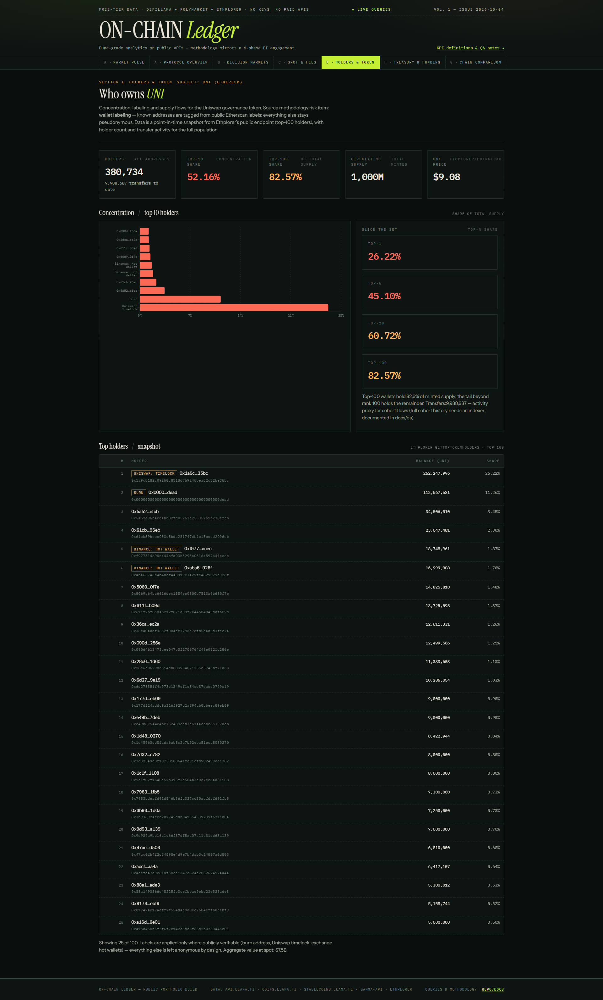
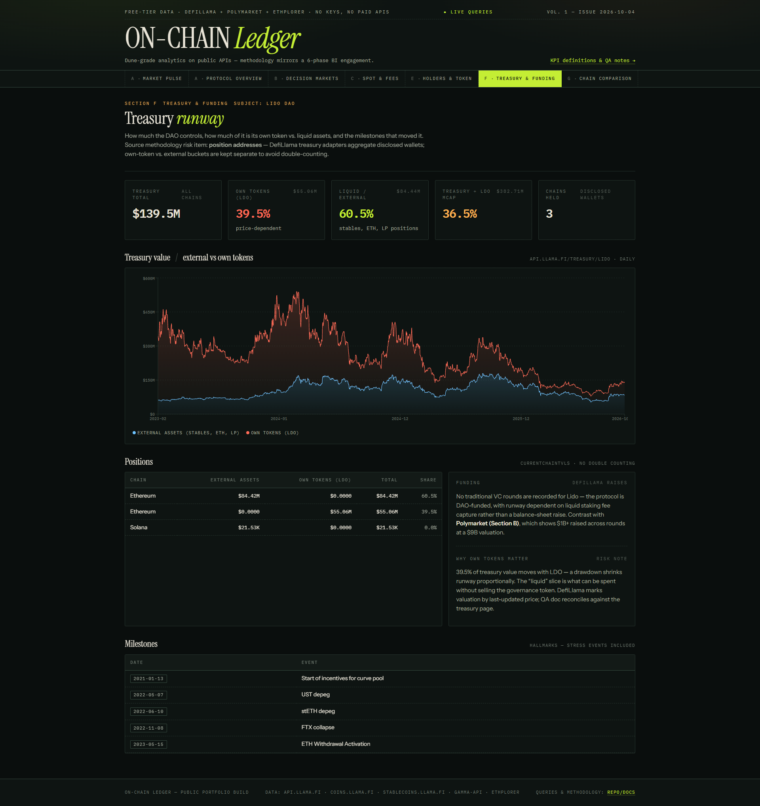
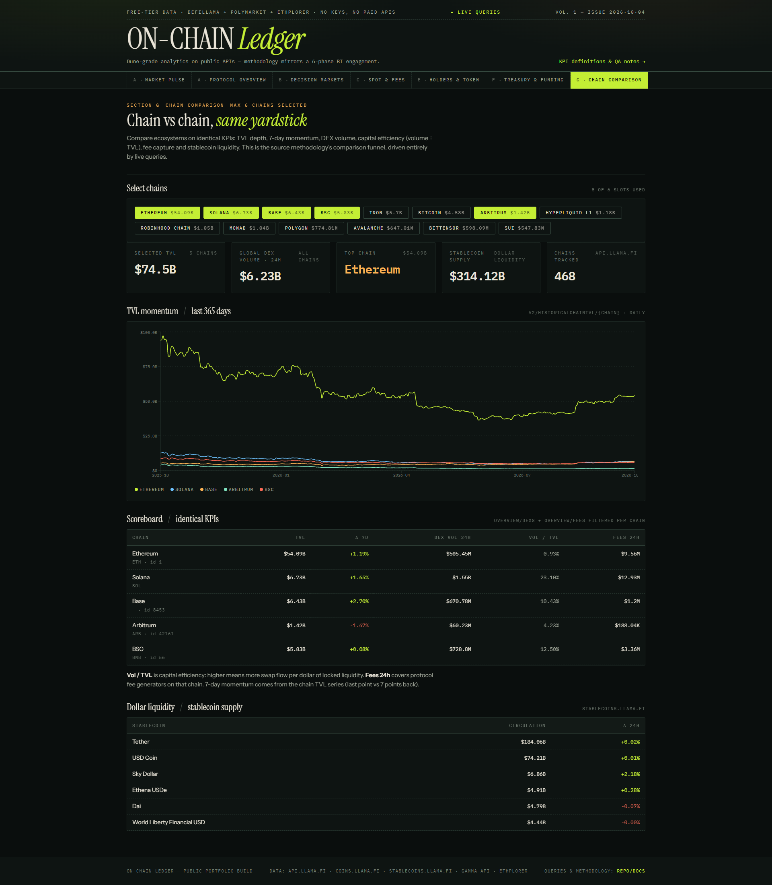

# On-Chain Ledger

**Dune-style DeFi analytics on free, keyless public APIs — plus a local DefiLlama MCP server.**

No API keys. No paid endpoints. No backend. Every number on every page is a live query
against a public REST API, and the query layer is committed to this repo so you can
audit exactly how each metric is derived.

[](https://0xanedi.github.io/web3-analytics/)
[](#data-sources)
[](METHODOLOGY.md)

---

## Dashboards

Seven dashboards, each mapped to a section of a proposed BI engagement scope (A, B, C, E, F, G).

### A · Market Pulse — global state of DeFi
Total value locked across ~468 tracked chains, DEX volume, protocol fees, stablecoin supply,
top chains by TVL, and the day's flow/fee leaders.



### A · Protocol Overview — Aave, decoded
One protocol end to end: TVL since 2020, net deposits per chain, and fee capture
(gross borrower interest, DefiLlama convention).



### B · Decision Markets — Polymarket
Prediction-market volume per market, implied probabilities against live spot prices,
and a 7-day time-weighted average of outcome prices so you can see how the crowd
has drifted from its own recent average.



### C · Spot & Fees — Uniswap
Spot volume and liquidity, LP fees generated daily, and the observed effective fee
rate (fees ÷ volume) — plus UNI price against its 7-day TWAP.



### E · Holders & Token — UNI
Concentration and supply flows for the Uniswap governance token, from a top-100
holder snapshot with only publicly verifiable labels applied.



### F · Treasury & Funding — Lido DAO
How much the DAO controls, how much is its own token versus liquid assets, and the
milestones that moved it. Own-token and external buckets are kept separate to avoid
double-counting.



### G · Chain Comparison — same yardstick
Identical KPIs across up to six chains: TVL depth, 7-day momentum, DEX volume,
capital efficiency (volume ÷ TVL), fee capture, and stablecoin liquidity.



---

## Data sources

All free, all keyless:

| Source | Used for |
|---|---|
| `api.llama.fi` | TVL, chains, protocol detail, fees, DEX volumes, treasury, raises, hallmarks |
| `coins.llama.fi` | Token prices |
| `stablecoins.llama.fi` | Stablecoin supply and peg prices |
| `gamma-api.polymarket.com` | Prediction markets and events |
| `clob.polymarket.com` | Outcome price history (for the TWAP) |
| `api.ethplorer.io` | Token holders and supply (public `freeKey` demo key) |
| `api.coingecko.com` | Token market charts (for price-vs-TWAP) |

---

## The MCP server

`mcp/defillama-mcp/` is a local, keyless [MCP](https://modelcontextprotocol.io) server that
exposes the same DefiLlama APIs as **9 typed tools + 3 prompts** over stdio, so an agent can
query DeFi data without leaving the editor.

It is built with FastMCP and designed around context discipline: historical time-series
arrays are stripped unless explicitly requested, list tools default to 15 rows (capped at 50),
and every response is truncated to a sane character budget with retry/backoff and caching
on the heavy endpoints.

```bash
cd mcp/defillama-mcp
uvx --from . defillama-mcp     # stdio transport
```

See [`mcp/defillama-mcp/README.md`](mcp/defillama-mcp/README.md) for editor configs
(opencode, Cursor, Claude Desktop).

---

## Repository layout

```
dashboards/          React + Vite + TypeScript app (static build → GitHub Pages)
  src/lib/queries.ts the typed query layer — every endpoint and derivation
  src/pages/         the seven dashboard pages
mcp/defillama-mcp/   local keyless DefiLlama MCP server (FastMCP, stdio)
scripts/             endpoint-shape QA probes (evidence for each metric)
docs/screenshots/    rendered dashboard captures
docs/dashboards/     KPI definitions and metric methodology per dashboard
docs/qa/             reconciliation notes and known data limitations
```

---

## Run the dashboards locally

```bash
cd dashboards
npm install
npm run dev        # http://localhost:5173
npm run build      # static output in dashboards/dist
```

The build uses a relative base and a hash router, so the same `dist/` works from any
account, repo, or sub-path on GitHub Pages without reconfiguration.

---

## How the metrics are defined

Every dashboard links its KPI definitions, and the derivations live in code rather than
in a spreadsheet. The engagement structure — Discovery → Setup → Build → QA → Launch →
Upkeep — is written up in [METHODOLOGY.md](METHODOLOGY.md), including the data
limitations that are documented rather than hidden.

**Known limitations** (also in `docs/qa/`): holder concentration is a point-in-time
top-100 snapshot, not a full historical cohort analysis (that needs an indexer); and
per-chain DEX volume uses DefiLlama's per-chain breakdown, which can be incomplete for
chains where protocols do not report a per-chain split.
